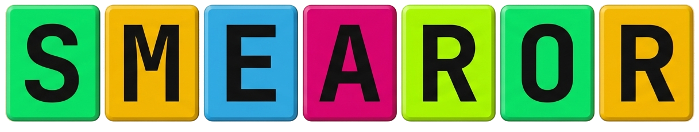

## The Smearor Project: Interactive Smart Desk Integration

Smearor is a professional-grade, interactive 65-inch Smart Desk that combines custom wood craftsmanship with tailored software integration. Evolving from an interactive smart mirror concept, Smearor is a 4K horizontal touchscreen table designed for multi-user collaboration, information display, and interactive work.

### Physical and Hardware Design

At its core, the system features a 65-inch iiyama ProLite 4K display with touch-through-glass technology. This screen is integrated horizontally into a custom wooden table frame supported by robust 70x70 mm corner legs. The horizontal interior cavity (under 50 mm in height) contains a modular, passively cooled hardware compartment. This houses an AMD Ryzen 5 8500G processor with PCIe Gen5 NVMe storage, a silent HDPLEX 250W passive GaN ATX power supply, a Raspberry Pi Zero 2 WH control board, and an integrated Canton soundbar.

### System Architecture

Smearor utilizes a modular subsystem architecture designed for reliability and straightforward maintenance:

* **Main PC Subsystem:** The AMD Ryzen 5 8500G handles the heavy computing tasks, running a tailored, lightweight Ubuntu Linux environment.
* **Microcontroller Subsystem:** A Raspberry Pi Zero 2 WH acts as an energy management controller. It monitors PC power states, manages monitor sleep modes, processes physical button inputs (using a PCF8574 I/O expander and optocouplers), and communicates keypresses.
* **Window Manager and User Interface:** The system runs a tailored Rust-based tiling window manager, supporting screen rotation, touch input management, custom gestures, an on-screen keyboard, and automatic soundbar power state coordination.

### Deployment and Maintenance

The Smearor desk is pre-assembled into modules and pre-wired to enable on-site installation and configuration within one day. Each installation is backed by a 5-year maintenance agreement that covers security updates and system diagnostics via SSH.

---

## Target Audiences and Use Cases

The Smearor platform is designed to adapt to a wide range of practical applications:

* **Corporate & Professional:** Boardrooms, architecture firms, legal practices, and marketing agencies use Smearor for interactive presentations, collaborative blueprint reviews, document management, and real-time data analytics.
* **Public & Exhibition Spaces:** Hotels, museums, and trade show booth builders leverage the touch surface for interactive wayfinding, self-service concierge systems, digital exhibits, and engaging prospective clients on exhibition floors.
* **Education & Research:** Schools, universities, and research institutes utilize Smearor as an interactive blackboard, cooperative learning surface, or scientific data visualization tool.
* **Entertainment & Creative Studios:** Music creators utilize the extensive screen area for multi-window DAW and DJ software touch control, while gaming lounges and tabletop RPG groups use Smearor to host digital maps and gamemaster tools.
* **Private Homes:** Individual clients can utilize the desk as a limited-edition centerpiece for home entertainment and personal organization.
